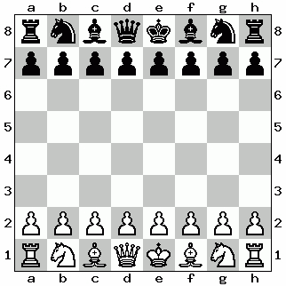

# sashimi

This is a chess engine: a computer program which plays chess.

Most chess engines use alpha-beta search, but Sashimi uses Monte Carlo Tree Search (MCTS).
It plays at the level of a strong amateur human (~1800-2000 Elo).

Sashimi is similar to [AlphaZero](https://en.wikipedia.org/wiki/AlphaZero) in that it does
not use rollouts.
However, Sashimi is unlike AlphaZero in that Sashimi uses linear models
for move selection and position evaluation rather than deep learning.
Sashimi also does not use reinforcement learning: the models are obtained by
training on a large dataset of human games from [Lichess](https://lichess.org/).

## Example game

This is a game where I (~1400 Elo) play white against Sashimi, which plays black. Sashimi ran on my laptop with
10s per move. On my laptop this is equivalent to about 2 million playouts per move.



**Jacob Jackson vs Sashimi, 0-1** ([PGN](example_game.pgn))

## How to play against Sashimi

Sashimi implements the UCI protocol, so you can use it with any chess GUI that speaks UCI.
I used [PyChess](http://pychess.org/) to test Sashimi.

You will need to build Sashimi in order to play against it.
**Sashimi requires nightly Rust.**
```
git clone https://github.com/zxqfl/sashimi
cd sashimi
cargo build --release --all
```
`cargo` is the Rust package manager.
If you don't have it, you can get it by
[installing Rust](https://www.rust-lang.org/en-US/install.html).

This should produce an executable `target/release/sashimi`
whose path you can provide to your GUI in order to play against Sashimi.
